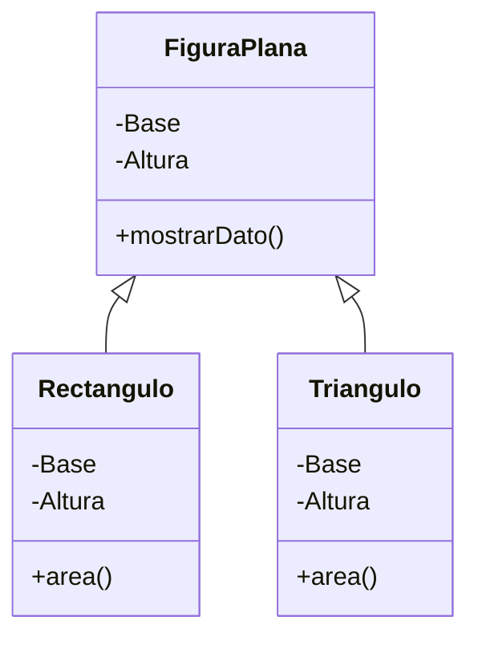

# Mi primer diagrama de clases

```mermaid
 classDiagram
      FiguraPlana <|-- Rectangulo
      FiguraPlana <|-- Triangulo

      class FiguraPlana{
          -Base
          -Altura
          +mostrarDato()
      }
      class Rectangulo{
          -Base
          -Altura
          +area()
      }
      class Triangulo{
          -Base
          -Altura
          +area()
      }
```