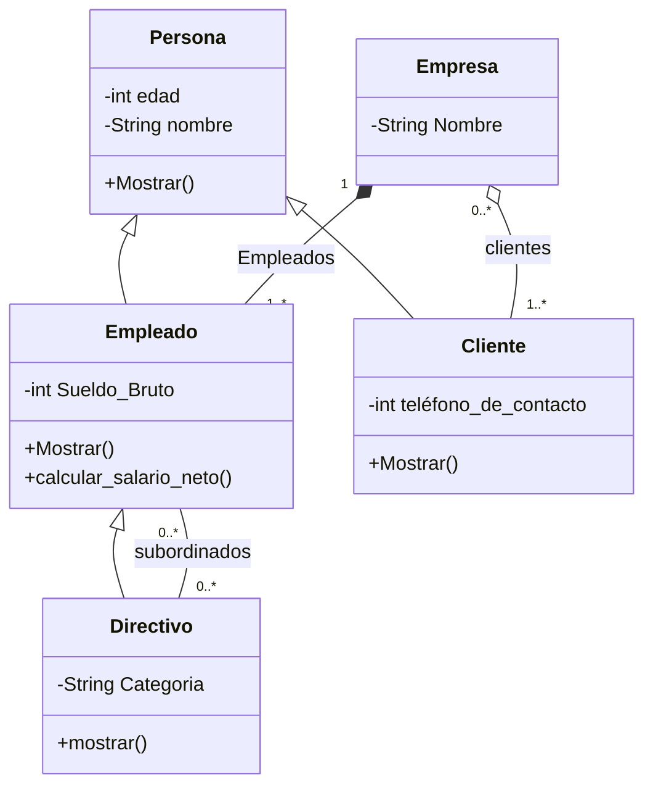

```mermaid
classDiagram
      Persona <|-- Empleado
      Persona <|-- Cliente
      Empleado <|-- Directivo
      Empleado "0..*" -- "0..*" Directivo : subordinados
      Empresa "1" *-- "1..*" Empleado : Empleados
      Empresa "0..*" o-- "1..*" Cliente : clientes
      Persona : -int edad
      Persona : -String nombre
      Persona : +Mostrar()
      class Empleado{
          -int Sueldo_Bruto
          +Mostrar()
          +calcular_salario_neto()
      }
      class Cliente{
          -int teléfono_de_contacto
          +Mostrar()
      }
      class Directivo{
          -String Categoria
          +mostrar()
      }
      class Empresa{
          -String Nombre
      }

```