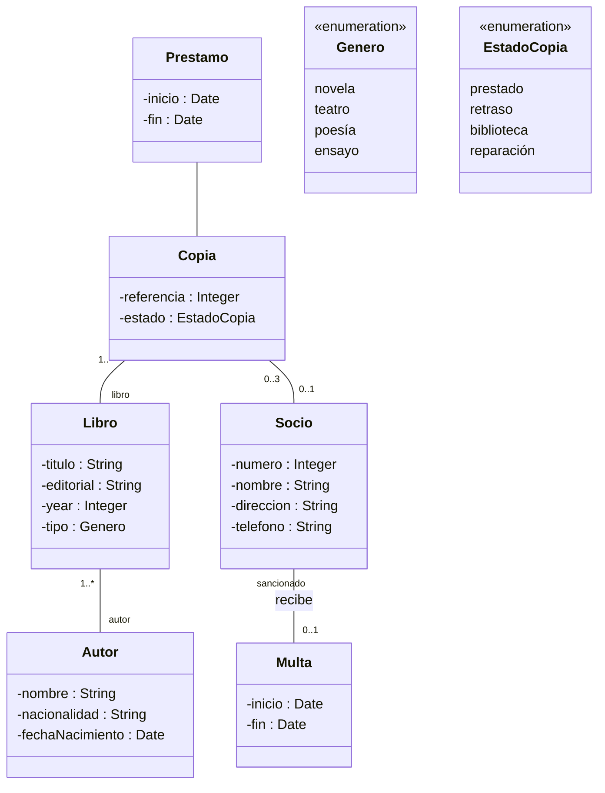

```mermaid
classDiagram
    Copia "1..*" -- "libro" Libro
      Copia "0..3" -- "0..1" Socio
      Socio "sancionado" -- "0..1" Multa : recibe
      Libro "1..*" -- "autor" Autor
      Prestamo -- Copia
      class Copia{
          -referencia : Integer
          -estado : EstadoCopia
      }
      class Socio{
          -numero : Integer
          -nombre  : String
          -direccion  : String
          -telefono  : String
      }
      class Prestamo{
          -inicio : Date
          -fin : Date
      }
      class Multa{
          -inicio : Date
          -fin : Date
      }
      class Libro{
          -titulo : String
          -editorial : String
          -year : Integer
          -tipo : Genero
      }
      class Autor{
          -nombre  : String
          -nacionalidad  : String
          -fechaNacimiento : Date
      }
      class Genero{
        <<enumeration>>
          novela
          teatro
          poesía
          ensayo
      }
      class EstadoCopia{
        <<enumeration>>
          prestado
          retraso
          biblioteca
          reparación
      }

```