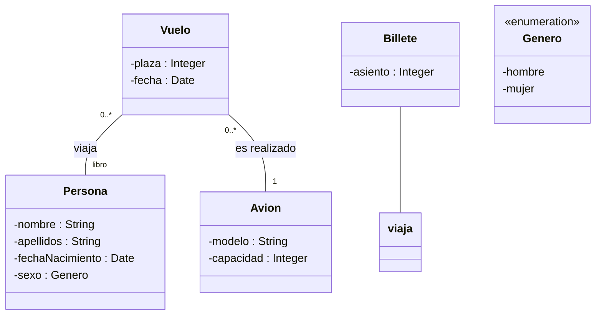

```mermaid
classDiagram
      Vuelo "0..*" -- "libro" Persona : viaja
      Vuelo "0..*" -- "1" Avion : es realizado
      Billete -- viaja
      class Vuelo{
          -plaza : Integer
          -fecha : Date
      }
      class Persona{
          -nombre  : String
          -apellidos : String
          -fechaNacimiento : Date
          -sexo : Genero
      }
      class Billete{
          -asiento : Integer
      }
      class Avion{
          -modelo : String
          -capacidad : Integer
      }
      class Genero{
        <<enumeration>>
          -hombre
          -mujer
      }
```