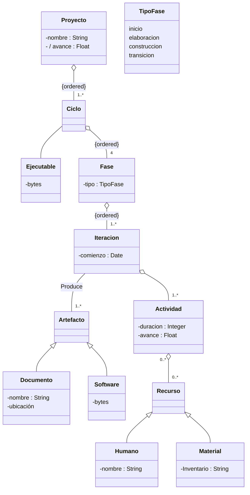

```mermaid
classDiagram
      Proyecto o-- "1..*" Ciclo : {ordered}
      Ciclo -- Ejecutable
      Ciclo o-- "4" Fase : {ordered}
      Fase o-- "1..*" Iteracion : {ordered}
      Iteracion -- "1..*" Artefacto : Produce
      Artefacto <|-- Documento
      Artefacto <|-- Software
      Iteracion o-- "1..*" Actividad
      Actividad "0..*" o-- "0..*" Recurso
      Recurso <|-- Humano
      Recurso <|-- Material
      class Proyecto{
          -nombre  : String
          - / avance : Float
      }
      class Ciclo
      class Ejecutable{
          -bytes
      }
      class Fase{
          -tipo : TipoFase
      }
      class TipoFase{
          inicio
          elaboracion
          construccion
          transicion
      }
      class Iteracion{
          -comienzo : Date
      }
      class Artefacto
      class Documento{
          -nombre : String
          -ubicación
      }
      class Software{
          -bytes
      }
      class Actividad{
          -duracion : Integer
          -avance : Float
      }
      class Recurso
      class Humano{
          -nombre : String
      }
      class Material{
          -Inventario : String
      }
```